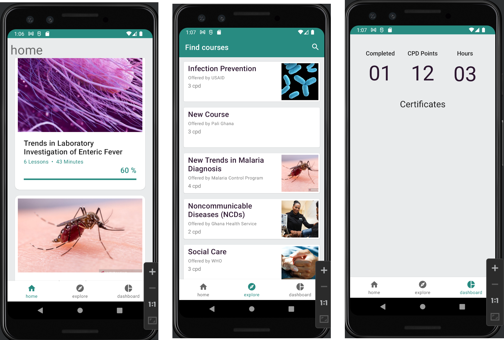
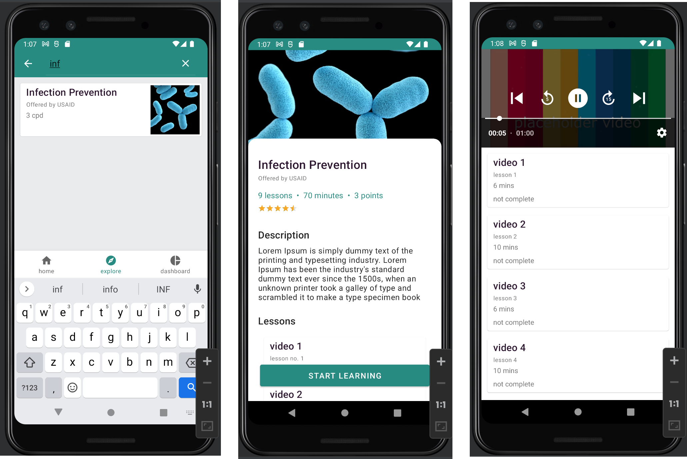

# EasyLearn

A mobile learning application for continues professional development of Allied Health Professionals.

## Description

Allied Health Practitioners in Ghana are required by their regulator to undergo continuous professional development. Online learning, especially through mobile devices has become a popular way to do lifelong learning and professional development. EasyLearn app proposes the idea of mobile learning as a means of professional development for Allied Health Practitioners

The resulting app was built using Modern Android Development techniques, including; MVVM Architecture, Coroutines, Flow, Room data persistence, dependency injection using Hilt. The app gets courses from a remote data source using Retrofit from a Simple RESTful application I created using SpringBoot; [EasyLearn Api](https://github.com/KAbaidoo/easyLearn-api). The video was implemented with [ExoPlayer](https://exoplayer.dev/). The app works on phones running Android version 5.0 (API level 21) and above.

Some of the features that was successfully implemented are listed below.

### Features

- Search for courses.
- Enroll into courses.
- Take video course.
- Course Detail screen.
- Implemented room with multiple tables.

## Installation

Clone this repository and import into **Android Studio**

```
git clone https://github.com/KAbaidoo/easy-learn

```

### Generating signed APK

From Android Studio:

1. Build menu
2. Generate Signed APK...
3. Fill in the keystore information (you only need to do this once manually and then let Android Studio remember it).

### TODOs

1. Dashboard to view completed courses, CPD points and Certificates and badges
2. Add Authentication and user management.

### Screenshots





## License

[MIT](https://choosealicense.com/licenses/mit/)
